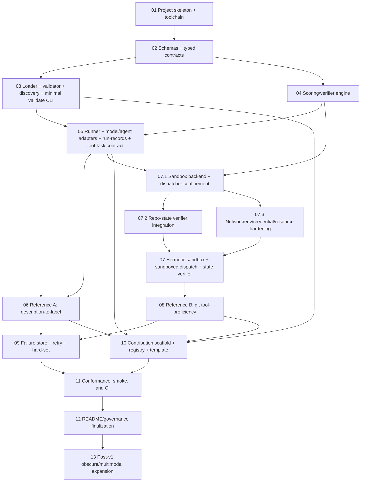

# README.md Goal Durable Plan

This plan turns the current `README.md` thesis into dependency-ordered implementation chunks. It is intentionally planning-only: no source implementation has started.

Recommended planning-artifact commit: `docs(plan): add durable README goal implementation plan`

## Source inputs

- Goal file: `README.md`
- Planning context: `local://ai-benchmarks-planning-context.json`
- Context results: `local://ai-benchmarks-context-results.json`
- Repository resume state from context: only `README.md` exists; implementation has not started.
- Context-agent caveat: the `benchmark-scope` and `technical-scaffold` results completed successfully. The `verification-risk`, `verification-risk-retry`, and `completeness-critic` context agents failed, so this plan does not rely on unavailable conclusions from those agents.

## README goal summary

The repository should become a small, credible benchmark suite and contribution path for non-lab, community-created AI benchmarks. It should demonstrate:

1. Quirky cross-domain benchmarks in the mold of Theo's SkateBench.
2. Agent tool-proficiency benchmarks in the mold of GitBench.
3. Reproducible failure-case preservation, retry, and hard-set growth.
4. A contribution flow that lets non-lab people add trustworthy benchmarks.
5. A path toward obscure domains and multimodal benchmarks without forcing that scope into v1.

## Rationale from context agents

- Metrics change incentives: once a benchmark is trusted, labs optimize for it. Therefore score reproducibility, provenance, and verifier determinism matter more than a large first dataset.
- The first implementation should prove two different verifier paths: answer matching for a description-to-label benchmark and repo-state checking for a tool-proficiency benchmark.
- Failure cases are not logs; they are first-class future benchmark items. The failure-store, retry command, and hard-set export belong in v1.
- Community contribution is core to the README thesis, so local validation, a benchmark template, and an auto-discovered registry are v1 requirements, not polish.
- Hermetic execution is required for tool-proficiency tasks. Git/agent tasks must run in an enforced sandbox backend (the bubblewrap namespace backend or the in-process allowlisted dispatcher defined in C07) and must not mutate the host repository. Temp directories may be used only as storage inside the sandbox boundary, never as the sandbox mechanism itself; a plain temp working tree plus `cwd`/env cleanup is explicitly NOT an accepted sandbox.
- Multimodal examples from the README, such as MRI cancer diagnosis and aerial image recognition, are important but should follow after the text/filesystem core is stable.

## Assumptions carried forward

- v1 targets text-in/text-out and filesystem/git tool tasks only.
- A model adapter is a thin, stubbable interface. For answer-matching benchmarks it is prompt plus params in, text out. For tool-proficiency benchmarks an agent adapter emits structured tool actions executed inside a per-case hermetic sandbox; the runner records a tool-action transcript and final repo state for the state-check verifier.
- The suite is a CLI plus on-disk fixtures and run-records, not a hosted service. The `ai-bench validate <benchmark>` command (per-benchmark) and the no-argument `ai-bench validate` command (validate all auto-discovered registered benchmarks) are minimal schema/loader gates delivered with the loader (C03) so benchmark chunks and the final gate can verify independently; the template/registry/contribution workflow is a later chunk (C10) and reuses these validate commands without adding a new one.
- Reproducible means same model id, prompt, params, seed, fixture version, and environment hash produce the same run-record shape and comparable results; it does not guarantee a provider will emit identical tokens forever.
- Reference benchmarks are original fixtures inspired by the README examples, not imports of Theo's actual SkateBench/GitBench artifacts.
- Use small, curated reference sets first: 20-50 cases per benchmark is enough for v1 credibility.
- Deterministic verifiers are preferred. An LLM-judge verifier is allowed only when its judge model, prompt, params, and seed are pinned into the run-record.
- Python 3.11+ with `uv` is the default toolchain unless an implementer finds a hard repo constraint that contradicts it.
- Benchmark definitions should be human-editable YAML validated by JSON Schema. Runtime code must use `yaml.safe_load` only.
- Runtime dependencies should stay boring and small: PyYAML and jsonschema are expected core dependencies; pytest is expected for verification.
- Avoid a plugin framework in v1. Built-in scorer/verifier modules are enough until a real benchmark proves otherwise.

## Proposed repository layout

This is the target layout for implementation chunks, not current state.

```text
README.md
planning/readme-goal-plan.md
planning/readme-goal-tracker.md
pyproject.toml
uv.lock
.gitignore
.github/workflows/ci.yml
schemas/benchmark.schema.json
schemas/case.schema.json
schemas/run-record.schema.json
schemas/failure-store.schema.json
src/ai_bench/__init__.py
src/ai_bench/cli.py
src/ai_bench/types.py
src/ai_bench/loader.py
src/ai_bench/scoring.py
src/ai_bench/runner.py
src/ai_bench/models.py
src/ai_bench/run_records.py
src/ai_bench/sandbox.py
src/ai_bench/failures.py
benchmarks/description-label/benchmark.yaml
benchmarks/description-label/cases/*.yaml
benchmarks/description-label/README.md
benchmarks/git-tooling/benchmark.yaml
benchmarks/git-tooling/cases/*.yaml
benchmarks/git-tooling/fixtures/**
benchmarks/git-tooling/README.md
benchmarks/_template/**
tests/**
CONTRIBUTING.md
```

## Dependency graph



## Parallelization rules

Implementation chunks may run in parallel only when all of the following are true:

1. They do not edit the same files or directories.
2. They do not change the same public interface, schema, generated artifact, CLI command, or checklist item.
3. Their dependencies are already complete and checked in the tracker.
4. Any shared contract they consume is already frozen by an earlier completed chunk.

Expected safe waves:
- Wave 3: C03 and C04 may run in parallel after C02 if C02 owns `src/ai_bench/types.py` and the schemas, and C03/C04 do not edit those contracts. C03 delivers the minimal `ai-bench validate <benchmark>` CLI so later benchmark chunks can satisfy their verification commands.
- Wave 4: C05 after C03+C04. C07 must run after C05 (not beside it) because it consumes the runner, agent-adapter, and run-record interfaces frozen by C05 to integrate the sandboxed dispatcher. C05 is the sole owner of `src/ai_bench/models.py` (text + agent/tool-task adapter contract) and `src/ai_bench/run_records.py` (including tool-action transcript and final repo-state fields); C07 may edit `src/ai_bench/runner.py` only to plug the sandboxed dispatcher into the C05 agent-adapter contract, and `src/ai_bench/scoring.py` only to implement the state-check verifier primitives whose interface shape was defined in C04. C07 must not edit `src/ai_bench/models.py` or `src/ai_bench/run_records.py`. C05's `--replay` mode is plumbing only and is tested against a fake/stub state-check verifier; it does NOT depend on C07. The real state-check verifier implementation lands in C07.2, which owns real-verifier transcript-replay acceptance (C05 `--replay` plumbing scored by the real verifier); C08/C11/C12 exercise that end-to-end with checked-in `--replay` samples. C07 is split into ordered sub-phases C07.1 (sandbox backend + dispatcher confinement) → C07.2 (repo-state verifier integration, depends on C07.1) and C07.3 (network/env/credential/resource hardening, depends on C07.1 and may run in parallel with C07.2); C07 is not checked until C07.1, C07.2, and C07.3 are all checked.
- Wave 5: C06 and C08 may run in parallel after C05+C07 if they own separate benchmark directories and do not edit shared runner/scoring APIs. Both can call `ai-bench validate`, delivered in C03, and `ai-bench run`, delivered in C05+C07. Their run verification relies on the C05 process-exit contract: zero means the selected cases were evaluated/scored and a schema-valid run-record was written, not that every case verdict passed.
- Wave 6: C09 and C10 should usually be serialized if both need CLI/registry changes; they may run in parallel only with explicit file ownership split. C10 no longer delivers `ai-bench validate` (moved to C03); it adds the template, registry, and contribution workflow on top of the existing validate command.
- Wave 7: C11, then C12, then C13 are serial finalization/expansion chunks.

## Chunk plan

### C01 — Project skeleton + toolchain

- Tracker id: `C01`
- Conventional Commit candidate: `chore: add Python project skeleton and CLI entry point`
- Owned files/scope:
  - `pyproject.toml`
  - `uv.lock`
  - `.gitignore`
  - `src/ai_bench/__init__.py`
  - `src/ai_bench/cli.py`
  - Initial `tests/` package if needed for smoke collection
- Dependencies: none.
- Parallel eligibility: none; this establishes the shared toolchain and paths.
- Deliverable:
  - Python 3.11+ project configured for `uv`.
  - Runtime dependencies selected for the planned architecture.
  - `ai-bench` CLI entry point with a minimal help path and placeholder subcommand surface only where needed for later chunks.
- Verification command(s):
  - `uv sync`
  - `uv run ai-bench --help`
  - `uv run pytest -q`
- Review criteria:
  - Dependency choices match the assumptions above and do not pull in a heavy ML stack.
  - CLI naming is stable enough for later chunks.
  - Skeleton has no benchmark behavior beyond harmless command wiring.
  - No generated/cache/build artifacts are committed except the lockfile.

### C02 — Schemas + typed contracts

- Tracker id: `C02`
- Conventional Commit candidate: `feat(schema): define benchmark, case, run-record, and failure-store contracts`
- Owned files/scope:
  - `schemas/benchmark.schema.json`
  - `schemas/case.schema.json`
  - `schemas/run-record.schema.json`
  - `schemas/failure-store.schema.json`
  - `src/ai_bench/types.py`
  - Schema fixture tests under `tests/test_schema.py`
- Dependencies: C01.
- Parallel eligibility: none; this freezes the full v1 shared contract surface consumed by loader, scoring, runner, sandbox, fixtures, failure store, and contributors. The C02 freeze applies only to v1 chunks C01-C12: no C01-C12 chunk may add a new `schemas/*.schema.json` file or extend these schemas in-flight; downstream v1 chunks consume them as-is. Schema evolution after v1 is owned by C13 as an explicit schema-version/migration plan (see C13), not by in-flight edits to the C02 schemas.
- Deliverable:
  - JSON Schemas for benchmark manifests, cases, run-records, and the failure-case store.
  - Required benchmark manifest fields include `id`, `name`, `description`, `domain`, `task_type`, `metric`, `version`, `contributor`, `license`, `case_glob`, benchmark-level `tags` (array of strings), and `status` (enum: `experimental` | `stable`). `status` defaults to `experimental` when omitted.
  - Required or modeled case fields include `id`, `input`, `expected`, `tags`, `difficulty`, `provenance`, and verifier metadata where needed. The case `tags` array reserves the `smoke` tag value: cases tagged `smoke` belong to that benchmark's smoke subset. The loader (C03) validates tag values and the runner (C05) selects the smoke subset via `--tag smoke`.
  - Run-record schema pins model id, prompt, sampling params, seed, fixture/manifest version, environment hash, per-case verdicts, raw output, and metric params. The run-record schema also defines the v1 tool-action transcript fields consumed by tool-proficiency tasks: per-action `command`, `argv`, `cwd`, `env_overrides`, `stdin`, `exit_code`, `stdout`, `stderr`, `wall_clock_ms`, `timeout` flag, and `sandbox_boundary_violation` flag; plus the final repo-state snapshot block (file tree, git status, branches, commits, diff) passed to the state-check verifier. These fields are frozen here so C05 implements against them and C07 does not need to extend `run_records.py`.
  - Failure-store schema (v1) defines the preserved failure-case record: benchmark/case id, manifest/fixture version, prompt or prompt-template version, model id, sampling params, seed, verifier/scorer version or metric params, environment hash, failed task input, model output, expected value, verifier verdict, run-record reference, and storage version. This is the full v1 failure-store surface; C09 consumes it without adding schema files.
  - `expected: null` is permitted only for preserved failure cases with explicit metadata.
- Verification command(s):
  - `uv run pytest tests/test_schema.py -q`
- Review criteria:
  - Schemas reject missing required identity/provenance/license fields.
  - Benchmark schema rejects unknown `status` values and accepts `experimental`/`stable`; `tags` is a string array.
  - Case schema accepts the reserved `smoke` tag and rejects malformed tag arrays.
  - Schemas can express exact/contains/regex/set-F1/state-check/LLM-judge verifier types without benchmark-specific code.
  - Run-record schema validates tool-action transcript and final repo-state fields, not just text-output records.
  - Failure-store schema validates a preserved failure record with the full reproducibility determinant set.
  - Typed contracts are generated from, or asserted against, schema fixtures so JSON Schema and runtime types cannot silently drift.
  - No benchmark fixtures are added in this chunk except minimal test fixtures.
  - The schema freeze is explicitly v1-scoped (C01-C12); C13 owns post-v1 schema evolution via a versioned migration plan with compatibility tests, not in-flight edits to these schemas.

### C03 — Loader + validator + discovery + minimal validate CLI

- Tracker id: `C03`
- Conventional Commit candidate: `feat(loader): validate and discover benchmark definitions with minimal validate CLI`
- Owned files/scope:
  - `src/ai_bench/loader.py`
  - CLI additions in `src/ai_bench/cli.py` for the `ai-bench validate` commands (both `<benchmark>` and no-argument validate-all forms)
  - Loader-specific test fixtures under `tests/fixtures/loader/**`
  - `tests/test_loader.py`
  - `tests/test_validate_cli.py` for both validate command forms
- Dependencies: C02.
- Parallel eligibility: may run in parallel with C04 after C02 if it does not edit `src/ai_bench/types.py`, schemas, or scorer APIs. The CLI addition is owned by C03 so C04/C05 do not collide on `cli.py`.
- Deliverable:
  - YAML/JSON benchmark loader using `yaml.safe_load` exclusively.
  - Manifest and case validation against JSON Schemas, including benchmark `tags`/`status` and the reserved case `smoke` tag.
  - `discover_benchmarks(root)` glob discovery with unique-id checks. Discovery excludes `benchmarks/_template/**` so the contribution template is never registered or conformance-tested as a real benchmark; template validation is owned by C10.
  - `load_cases(benchmark)` resolving `case_glob` safely inside the benchmark directory, with tag-based subset selection support (`smoke` and arbitrary tags).
  - Deterministic canonical serialization helper for stable comparisons.
  - `ai-bench validate <benchmark>` CLI: loads a benchmark directory, validates its manifest and all cases against the JSON Schemas, and reports actionable per-file/per-field errors. Schema-and-loader validation gate only; no smoke run (that arrives in C05) and no template/registry/contribution workflow (that arrives in C10).
  - `ai-bench validate` (no argument) CLI: the release validate-all gate. Run at the repository root, it auto-discovers every registered benchmark via `discover_benchmarks(root)` (excluding `benchmarks/_template/**`) and validates each against the JSON Schemas, reporting a per-benchmark pass/fail summary and an overall exit code. This is the final-gate validation command used by C12; it is delivered in C03, not C10. Release semantics: when run at the repo root it validates only real benchmarks and is expected to PASS on a healthy repo — it is NOT a negative-test command. Malformed-fixture rejection is tested separately (see verification commands and `tests/test_validate_cli.py`) so that release pass/fail behavior is unambiguous.
- Verification command(s):
  - `uv run pytest tests/test_loader.py tests/test_validate_cli.py -q`
  - `uv run ai-bench validate tests/fixtures/loader/valid_benchmark` (or equivalent fixture path) succeeds.
  - Negative fixture test (separate from release behavior): malformed-fixture rejection is asserted by `tests/test_validate_cli.py` via pytest, and/or by an explicit command scoped to the fixture root/cwd, e.g. `uv run ai-bench validate tests/fixtures/loader/malformed_manifest` fails with an actionable error. This must NOT be the repo-root no-argument `ai-bench validate` command.
  - Release validate-all gate (positive): `uv run ai-bench validate` (no argument) run at the repository root validates only real registered benchmarks (excluding `benchmarks/_template/**`) and is expected to PASS on a healthy repo; it is the final-gate command reused by C12. Its pass/fail semantics are unambiguous because malformed fixtures live under `tests/fixtures/**` (not discovered as real benchmarks) and are exercised only by the negative test above.
- Review criteria:
  - Unsafe YAML loaders are not used anywhere.
  - Path handling prevents case globs from escaping the benchmark directory.
  - Malformed manifests and malformed cases fail with actionable errors.
  - Canonical serialization is deterministic across repeated loads.
  - Both `ai-bench validate <benchmark>` and no-argument `ai-bench validate` exist and are usable by C06/C08/C12 before C10 is built; they reject invalid manifests/cases and accept valid ones without requiring a model or smoke run.
  - Release behavior is separated from negative fixture testing: the repo-root no-argument `ai-bench validate` validates only real benchmarks and passes on a healthy repo; invalid-fixture failure is tested via pytest or an explicit fixture-root/cwd command, not by running the release validate-all against a tree containing malformed fixtures.
  - Discovery excludes `benchmarks/_template/**`.

### C04 — Scoring/verifier engine

- Tracker id: `C04`
- Conventional Commit candidate: `feat(scoring): add built-in deterministic benchmark verifiers`
- Owned files/scope:
  - `src/ai_bench/scoring.py`
  - Scoring test fixtures under `tests/fixtures/scoring/**`
  - `tests/test_scoring.py`
- Dependencies: C02.
- Parallel eligibility: may run in parallel with C03 after C02 if it consumes the frozen types and does not edit loader files.
- Deliverable:
  - Built-in verifier/scorer functions for `exact_match`, `contains_any`, `regex_match`, and `set_f1`.
  - State-check verifier interface shape for tool-proficiency tasks, with implementation completed in C07 if repo-state checks require sandbox artifacts.
  - LLM-judge verifier contract that requires pinned judge model/prompt/params/seed, with a deterministic mock for tests only.
  - `score_case(case, observed)` and aggregate score helpers.
- Verification command(s):
  - `uv run pytest tests/test_scoring.py -q`
- Review criteria:
  - Deterministic verifier outputs are stable and explainable.
  - Edge cases are covered: empty expected sets, extra whitespace, regex mismatch, full/partial set-F1, and null expected failure cases.
  - LLM-judge path cannot run without pinned metadata.
  - No arbitrary dotted-path custom code execution is introduced in v1.

### C05 — Runner + model/agent adapters + run-records + tool-task execution contract

- Tracker id: `C05`
- Conventional Commit candidate: `feat(runner): execute benchmarks with reproducible run records and tool-task agent adapter`
- Owned files/scope:
  - `src/ai_bench/runner.py`
  - `src/ai_bench/models.py` (text model adapter + agent/tool-task adapter interface). C05 is the sole owner of `models.py` and the agent/tool-task adapter contract; C07 must not edit this file.
  - `src/ai_bench/run_records.py` implementing the tool-action transcript and final repo-state fields frozen by the C02 run-record schema. C05 is the sole owner of these run-record fields; C07 must not edit this file.
  - CLI additions in `src/ai_bench/cli.py`
  - Runner tests under `tests/test_runner.py`, `tests/test_run_records.py`, and `tests/test_agent_adapter.py`
- Dependencies: C03 and C04.
- Parallel eligibility: normally serial because it wires loader, scoring, model adapters, and CLI. C07 runs after C05 (see C07) to plug the sandboxed dispatcher into the agent-adapter contract defined here; C07 does not redefine the adapter or run-record transcript contract.
- Deliverable:
  - Thin text model-adapter interface: prompt plus params in, text out, for answer-matching benchmarks.
  - Stub text adapter for deterministic tests and smoke runs.
  - Agent/tool-task adapter interface for sandboxed tool-proficiency benchmarks, owned solely here. The contract defines:
    - How a case invokes an agent in a per-case sandbox: the runner creates an isolated working directory, mounts/copies the case fixture into it, and hands the agent a sandbox handle (working dir, allowed commands, env allowlist, timeouts) plus the task prompt and params.
    - How an agent/model emits tool actions: a structured action stream (command name, argv, cwd relative to sandbox, env overrides, stdin) rather than free text, with a deterministic stub agent that emits a scripted sequence of git/file actions.
    - How commands are dispatched inside the sandbox only: a sandboxed command dispatcher runs each action with working-directory, path, and host-boundary confinement; outbound network is denied; env is cleared/allowlisted; timeouts and resource limits are enforced. C05 defines the dispatcher interface and the runner integration point; the enforced dispatcher implementation lives in C07 and plugs in here.
    - What is captured in the run-record per action (frozen by the C02 run-record schema): command, argv, cwd, exit code, stdout, stderr, wall-clock duration, timeout flag, and sandbox-boundary violation flag; plus the final repo-state snapshot passed to the verifier.
    - How final repo state is passed to the state-check verifier: the runner materializes the post-run sandbox state (file tree, git status, branches, commits, diffs) and hands it to the state-check scorer from C04/C07.
  - `ai-bench run <benchmark>` command that loads cases, selects the text or agent adapter based on benchmark `task_type`, executes, scores outputs/repo-state, and writes run-record JSON/JSONL. Supports `--tag <tag>` (e.g. `--tag smoke`) to run only cases carrying that tag, so the smoke subset has a durable CLI contract.
  - `ai-bench run` process-exit semantics are part of the public C05 CLI contract: the command exits 0 when the selected cases are loaded, evaluated, scored, and a schema-valid run-record is written, regardless of pass rate or failed case verdicts. It exits non-zero for benchmark/case validation failures, load errors, adapter/runtime/infrastructure failures, sandbox/dispatcher infrastructure errors, verifier exceptions or invalid verifier configuration, missing selected predictions/transcripts, unevaluated or unscored selected cases, and run-record write or schema-validation failures. Evaluation verdict failures are data in the run-record, not command failures.
  - Run-record includes pinned prompt, model id, params, seed, fixture/manifest version, environment hash, per-case verdict, raw output (text or tool-action transcript), and metric params, conforming to the C02 run-record schema.
  - C09 failure-preservation compatibility: every C05 run-record exposes the per-case verdict, raw output/tool transcript, expected value, provenance, params, seed, environment hash, and run-record identity needed by `ai-bench failures save <run-record> --store <failure-store>`. C05 does not mutate the failure store, but its run-record and exit semantics must make scored failures distinguishable from process failures for C09.
  - CI-safe non-stub evaluation path, so the active v1 checklist cannot pass on deterministic stubs alone. The runner supports two offline, hermetic, no-network evaluation modes in addition to the stub adapter:
    - File-based text predictions: `ai-bench run <benchmark> --predictions <dir>` (or `--predictions-file`) loads per-case text predictions from on-disk files (one prediction per case id, mapping case id → predicted text), scores them with the real C04 verifiers (not a stub), and writes a validated run-record whose `model id` records the prediction source (e.g. `file:<dir>`) rather than a live provider. This scores real submitted model outputs without any API key or network call.
    - Transcript replay plumbing for tool-proficiency tasks: `ai-bench run <benchmark> --replay <transcript-dir>` loads submitted agent/tool-action transcripts (JSON/JSONL conforming to the C02 run-record transcript fields) plus an optional pre-materialized final repo-state snapshot per case, hands them to the state-check verifier interface (shape defined in C04), and writes a validated run-record, without re-executing commands in a sandbox. C05 delivers the replay plumbing only (loading, schema validation, snapshot materialization, and hand-off to the verifier interface) and tests it against a fake/stub state-check verifier — mirroring the fake-dispatcher pattern used for the agent-adapter contract test. C05 does NOT score real transcripts through the real state-check verifier, because the real state-check verifier implementation is not delivered until C07.2; C05 depends on C04 (verifier interface shape + complete text verifiers) and does NOT depend on C07. Real-verifier transcript-replay acceptance (scoring real submitted agent transcripts through the real state-check verifier) is owned by C07.2 and exercised end-to-end with checked-in `--replay` samples in C08/C11/C12.
  - Both non-stub modes require run-record validation against `schemas/run-record.schema.json` (including tool-action transcript and final repo-state fields for replay mode) and must not require live API keys, network access, or host mutation. The stub adapter remains for deterministic tests/smoke. The file-prediction mode scores real text outputs through the real C04 text verifiers (complete in C04). The replay mode in C05 is plumbing only and is tested against a fake/stub state-check verifier; real-verifier transcript-replay acceptance is deferred to C07.2 and exercised end-to-end with checked-in `--replay` samples in C08/C11/C12 and the final verification log (see those chunks).
- Verification command(s):
  - `uv run pytest tests/test_runner.py tests/test_run_records.py tests/test_agent_adapter.py -q`
  - Explicit reproducibility check in tests: same stub seed yields byte-identical record content except documented run id/timestamp fields; changed seed changes only expected fields.
  - Agent-adapter contract test: a deterministic stub agent emits a scripted git action sequence against an in-process fake dispatcher, the run-record captures the action transcript with exit codes/stdout/stderr/durations, and the runner hands final state to the state-check verifier interface. (The real sandboxed dispatcher is exercised in C07.)
  - Smoke-selector test: `ai-bench run <benchmark> --tag smoke --model stub` runs only `smoke`-tagged cases.
  - Non-stub file-prediction test: `ai-bench run <benchmark> --predictions <fixture-pred-dir>` scores a small fixture of real text predictions with the real C04 verifiers (no stub adapter), writes a run-record that validates against `schemas/run-record.schema.json`, and requires no API key/network.
  - Non-stub transcript-replay plumbing test: `ai-bench run <benchmark> --replay <fixture-transcript-dir>` replays a small fixture of submitted agent/tool-action transcripts through the state-check verifier interface using a fake/stub state-check verifier (no sandbox re-execution, no real state-check verifier — that arrives in C07.2), writes a validated run-record, and requires no API key/network/host mutation. This verifies replay loading/snapshot-materialization/hand-off plumbing only; real-verifier transcript-replay acceptance is verified in C07.2 and exercised end-to-end in C08/C11/C12.
  - Run/CLI exit-contract tests: intentionally failed case verdicts in stub, `--predictions`, and `--replay` modes still exit 0 and write schema-valid run-records; malformed benchmark/case data, missing prediction or transcript inputs, adapter/runtime/infrastructure failures, verifier exceptions or invalid verifier config, unevaluated/unscored selected cases, and run-record write/schema-validation failures exit non-zero.
- Review criteria:
  - No live API keys or external services are required.
  - Run-records validate against `schemas/run-record.schema.json`, including tool-action transcript and final repo-state fields frozen by C02.
  - Environment hashing is deterministic and excludes volatile result output paths.
  - The runner does not silently skip cases or swallow verifier errors.
  - `ai-bench run` exit codes distinguish evaluation verdicts from command failures: failed verdicts or low aggregate scores are preserved in the run-record with exit 0, while validation/load/runtime/infrastructure/verifier/run-record failures are non-zero. C06, C08, and C11 gates rely on this distinction instead of treating a low score as a broken command.
  - The agent-adapter contract is defined solely here before C07/C08 so the sandbox implementation and git-tooling fixtures have a stable interface to target; the contract does not depend on C07 being complete, and C07 must not edit `models.py` or `run_records.py`.
  - A CI-safe non-stub evaluation path exists and is tested: file-based text predictions score real text outputs through the real C04 text verifiers (complete in C04), and transcript-replay plumbing loads real submitted transcripts, materializes snapshots, and hands them to the state-check verifier interface (tested against a fake/stub verifier in C05). Both write run-records that validate against the schema and require no live API keys, network, or host mutation — so the v1 checklist cannot pass on deterministic stubs alone. Real-verifier transcript-replay acceptance (scoring real submitted agent transcripts through the real state-check verifier) is NOT a C05 acceptance criterion; it is owned by C07.2 and exercised end-to-end with checked-in `--replay` samples in C08/C11/C12.

### C06 — Reference benchmark A: description-to-label benchmark
- Tracker id: `C06`

- Conventional Commit candidate: `feat(benchmarks): add description-to-label reference benchmark`
- Owned files/scope:
  - `benchmarks/description-label/benchmark.yaml`
  - `benchmarks/description-label/cases/*.yaml`
  - `benchmarks/description-label/README.md`
  - Benchmark-specific tests under `tests/test_description_label_benchmark.py` if needed
- Dependencies: C03 and C05. (C03 provides `ai-bench validate`; C05 provides `ai-bench run`, the text model adapter, and the `--tag smoke` selector.)
- Parallel eligibility: may run in parallel with C08 after C05+C07 if it owns only `benchmarks/description-label/**` and benchmark-specific tests.
- Deliverable:
  - 20-50 original, non-imported, description-to-label cases inspired by SkateBench's niche-language/spatial-reasoning shape.
  - Exact or fuzzy deterministic verifier metadata.
  - Benchmark manifest populates the C02 benchmark-level `tags` and `status` fields (e.g. `status: experimental`, recreation/spatial-reasoning tags).
  - Domain/tags metadata showing recreation, spatial reasoning, niche English, and syntax-like parsing.
  - A smoke subset defined by the reserved `smoke` case tag (at least one `smoke`-tagged case) usable by the stub model.
- Verification command(s):
  - `uv run ai-bench validate benchmarks/description-label`
  - `uv run ai-bench run benchmarks/description-label --model stub`
  - `uv run ai-bench run benchmarks/description-label --tag smoke --model stub`
  - `uv run pytest tests/test_description_label_benchmark.py -q` if benchmark-specific tests are added.
  - Non-stub offline scoring sample: `uv run ai-bench run benchmarks/description-label --predictions benchmarks/description-label/sample_predictions` (a checked-in small set of real text predictions) scores them with the real C04 verifiers and writes a validated run-record, proving the benchmark is scoreable off real outputs without a stub or live model.
  - C05 exit-contract dependency: these `ai-bench run` commands pass their process gate when they evaluate the selected cases, score them, and write schema-valid run-records, even if some case verdicts fail. A non-zero exit is treated as validation/load/runtime/infrastructure/verifier/run-record failure and blocks C06.
- Review criteria:
  - Cases are original and do not imply Theo endorsement.
  - Expected answers are unambiguous enough for deterministic verification.
  - Manifest populates `tags` and `status` per the C02 schema.
  - Metadata includes contributor/license/provenance.
  - A checked-in non-stub prediction sample is scored by the real verifiers (not a stub) and produces a valid run-record, exercising the CI-safe non-stub path from C05.
  - Smoke run via `--tag smoke` emits a valid non-empty run-record and aggregate score covering only the `smoke`-tagged cases.
  - Acceptance is based on schema-valid run-records and correct benchmark wiring, not on every sample prediction or stub verdict passing; failed verdicts remain visible as scored evaluation results.

### C07 — Hermetic sandbox + sandboxed dispatch + repo-state verifier

- Tracker id: `C07`
- Conventional Commit candidate: `feat(sandbox): add hermetic sandboxed task execution and repo-state verifier`
- Owned files/scope:
  - `src/ai_bench/sandbox.py` (sandbox creation, sandboxed command dispatcher, security policy, repo-state snapshot)
  - State-check verifier implementation in `src/ai_bench/scoring.py` for the interface shape defined in C04
  - Runner integration in `src/ai_bench/runner.py` only to plug the sandboxed dispatcher into the C05 agent-adapter contract
  - Sandbox fixtures under `tests/fixtures/sandbox/**`
  - `tests/test_sandbox.py`, `tests/test_sandbox_integration.py`, and `tests/test_sandbox_hardening.py` (C07.1, C07.2, C07.3 respectively)
- Dependencies: C04 and C05. C07 runs after C05 so it can plug the sandboxed dispatcher into the agent-adapter and run-record interfaces frozen by C05/C02. C07 must not edit `src/ai_bench/models.py` or `src/ai_bench/run_records.py`; the adapter contract and transcript fields are already frozen.
- Parallel eligibility: none with C05; C07 consumes the runner/agent-adapter/run-record interfaces frozen by C05 and the schemas frozen by C02. After C05, C07 may run in parallel with C06 only if C06 stays inside `benchmarks/description-label/**` and does not edit shared runner/sandbox APIs.
- Deliverable (ordered sub-phases — C07.1 then C07.2 then C07.3; each sub-phase is a separate reviewable commit and checklist item set in the tracker; C07 is not checked until all three sub-phases pass):

  #### C07.1 — Sandbox backend + sandboxed dispatcher confinement

  - Concrete enforced sandbox backend, not a plain temp working tree. The primary backend is bubblewrap (`bwrap`) on Linux using user + mount + network namespaces plus a seccomp filter, with an empty network namespace (loopback only) and a private mount table rooted at the sandbox dir. The fallback backend, used when `bwrap` is unavailable or the host is non-Linux, is a deliberately narrow in-process allowlisted operation dispatcher: no shell, no arbitrary subprocess; only a vetted set of git/file operations implemented in-process against the sandbox root. Both backends enforce the same boundary contract; the active backend is recorded in the run-record environment hash. A plain temp working tree plus `cwd`/env cleanup is explicitly NOT sufficient and must not be accepted as the sandbox mechanism; temp dirs are storage inside the boundary only.
  - Host prerequisites and fallbacks documented: Linux + `bwrap` required for the namespace backend; otherwise the in-process allowlisted dispatcher backend is used and the benchmark case set is restricted to operations the allowlist supports. The backend selection is explicit and tested, not silent.
  - Read-only fixture mounting/copying strategy that prevents fixture mutation across cases.
  - Sandboxed command dispatcher implementing the C05 agent-adapter dispatch contract: runs each tool action with working-directory, path, and host-boundary confinement; records exit code, stdout, stderr, wall-clock duration, timeout flag, and sandbox-boundary violation flag into the run-record transcript (fields frozen by C02/C05). Absolute paths and symlink escapes outside the sandbox root are rejected and recorded.
  - No-host-mutation assertions (host-tree hash before/after) and cleanup-on-failure coverage.
  - C07.1 verification: `uv run pytest tests/test_sandbox.py -q` (backend selection, dispatcher confinement, path/symlink-escape rejection, host-tree-hash invariance, cleanup).
  - C07.1 review criteria: sandbox backend is concrete and enforced (bwrap namespaces or in-process allowlisted dispatcher), not a plain temp working tree; backend selection explicit and recorded; working-directory/path/host-boundary confinement enforced and recorded; host repo cannot be mutated (verified by host-tree hash before/after); cleanup reliable after success and failure; dispatcher satisfies the C05 agent-adapter contract; `models.py` and `run_records.py` not edited.

  #### C07.2 — Repo-state verifier integration

  - Repo-state verifier primitives for expected files, diffs, branches, commits, and absence/presence checks, receiving the final sandbox state snapshot from the runner (interface shape defined in C04; implementation completed here). This is the real state-check verifier implementation that the C05 `--replay` plumbing hands transcripts/snapshots to; until C07.2 lands, C05's `--replay` is tested only against a fake/stub state-check verifier.
  - Runner integration in `src/ai_bench/runner.py` only to plug the sandboxed dispatcher into the C05 agent-adapter contract and hand the final repo-state snapshot to the state-check verifier.
  - Integration test proving a deterministic stub agent can perform a git task only inside the sandbox and the state-check verifier observes the resulting repo state (pass and fail paths).
  - Real-verifier transcript-replay acceptance: `ai-bench run <benchmark> --replay <fixture-transcript-dir>` replays a small fixture of submitted agent/tool-action transcripts (with final repo-state snapshots) through the now-implemented real state-check verifier (the C05 `--replay` plumbing wired to the C07.2 verifier), writes a validated run-record, and requires no API key/network/host mutation. This is the real-verifier transcript-replay acceptance that C05 deliberately defers; it is owned here and exercised end-to-end with checked-in `--replay` samples in C08/C11/C12.
  - C07.2 verification: `uv run pytest tests/test_sandbox_integration.py -q`; integration scenario where `ai-bench run` against a sandbox fixture with the stub agent creates a commit inside the sandbox, the state-check verifier passes, and the host repository is byte-identical before and after; plus the real-verifier transcript-replay acceptance test above passing.
  - C07.2 review criteria: verifier failures explain the state mismatch; pass and fail state-check paths are exercised; runner integration only plugs the dispatcher and does not edit `models.py` or `run_records.py`; C08 fixtures can target the verifier without further runner changes; real-verifier transcript-replay acceptance (C05 `--replay` plumbing scored by the real state-check verifier) passes and is no longer deferred from C05.

  #### C07.3 — Network/env/credential/resource-limit hardening

  - Enforced sandbox security policy for untrusted tool tasks, by default:
    - Deny outbound network access for sandboxed commands (no socket/HTTP/git remote fetch); attempted network access fails fast and is recorded as a boundary violation.
    - Clear inherited environment variables and allowlist only the minimal env needed for git/file operations (e.g. `PATH`, `HOME` pointing inside the sandbox, `GIT_*` safe values); strip credentials, tokens, SSH keys, and cloud-provider env vars.
    - Prevent credential leakage: no host `~/.gitconfig`, `~/.ssh`, `~/.aws`, or credential helpers are visible inside the sandbox.
    - Enforce per-command timeouts and resource limits (CPU/wall-clock, process count, disk write where feasible).
  - Required acceptance tests proving the enforced boundary (not just a temp dir):
    - Absolute-path and symlink-escape read/write outside the sandbox root fail and are recorded.
    - Git remote/network access (fetch/clone/push) fails and is recorded.
    - Credential helpers, host `~/.gitconfig`, `~/.ssh`, `~/.aws`, and cloud-provider env access are unavailable and any attempt is recorded.
    - Subprocess/process-count/CPU/wall-clock limits are enforced; a spawning or long-running action is killed and recorded.
    - Every boundary violation above is recorded in the run-record transcript with the `sandbox_boundary_violation` flag and a reason.
  - C07.3 verification: `uv run pytest tests/test_sandbox_hardening.py -q` (or equivalent hardening acceptance tests); boundary-violation scenario where every required acceptance test above fails closed and is recorded in the run-record transcript.
  - C07.3 review criteria: security posture is enforced (not just documented): no broad host mounts, no unchecked path joins, no command execution outside the sandbox boundary, no outbound network, no inherited credentials, timeouts/resource limits applied, and every violation is recorded with a reason.

  Sub-phase ordering and dependencies: C07.1 (backend + dispatcher confinement) is the foundation; C07.2 (repo-state verifier integration) depends on C07.1; C07.3 (hardening) depends on C07.1 and may run in parallel with C07.2 since it hardens the C07.1 dispatcher without touching the verifier integration. C07 is checked only when C07.1, C07.2, and C07.3 are all checked.
- Verification command(s) (C07 overall — all sub-phase commands must pass):
  - `uv run pytest tests/test_sandbox.py tests/test_sandbox_integration.py tests/test_sandbox_hardening.py -q`
  - Integration scenario: `ai-bench run` against a sandbox fixture with the stub agent creates a commit inside the sandbox, the state-check verifier passes, and the host repository is byte-identical before and after.
  - Boundary-violation scenario: every required C07.3 acceptance test fails closed and is recorded in the run-record transcript.
- Review criteria (C07 overall):
  - Host repository cannot be mutated by a benchmark case; verified by host-tree hash before/after.
  - Sandbox cleanup is reliable after success and failure.
  - Verifier failures explain the state mismatch.
  - The sandbox backend is concrete and enforced (bwrap namespaces or in-process allowlisted dispatcher), not a plain temp working tree; backend selection is explicit and recorded.
  - Security posture is enforced (not just documented): no broad host mounts, no unchecked path joins, no command execution outside the sandbox boundary, no outbound network, no inherited credentials, timeouts/resource limits applied, and every violation is recorded.
  - The sandboxed dispatcher satisfies the C05 agent-adapter contract so C08 fixtures can target it without further runner changes; C07 did not edit `models.py` or `run_records.py`.
  - Real-verifier transcript-replay acceptance (C05 `--replay` plumbing scored by the real state-check verifier implemented in C07.2) passes; C05's `--replay` plumbing is verified separately against a fake/stub verifier and does not block on C07.
  - C07 is not checked until all three ordered sub-phases (C07.1, C07.2, C07.3) are individually checked in the tracker.

### C08 — Reference benchmark B: git tool-proficiency benchmark

- Tracker id: `C08`
- Conventional Commit candidate: `feat(benchmarks): add git tool-proficiency reference benchmark`
- Owned files/scope:
  - `benchmarks/git-tooling/benchmark.yaml`
  - `benchmarks/git-tooling/cases/*.yaml`
  - `benchmarks/git-tooling/fixtures/**`
  - `benchmarks/git-tooling/README.md`
  - Benchmark-specific tests under `tests/test_git_tooling_benchmark.py` if needed
- Dependencies: C03, C05, and C07. (C03 provides `ai-bench validate`; C05 provides the agent-adapter and run-record contract and `--tag smoke` selector; C07 provides the enforced sandboxed dispatcher and state-check verifier that C08 fixtures target.)
- Parallel eligibility: may run in parallel with C06 after C05+C07 if it owns only `benchmarks/git-tooling/**` and benchmark-specific tests.
- Deliverable:
  - 20-50 original git/tool-use tasks with expected repository states.
  - Fixture repositories small enough for fast smoke verification.
  - State-check verifier metadata for each case.
  - Benchmark manifest populates the C02 benchmark-level `tags` and `status` fields (e.g. `status: experimental`).
  - Smoke subset defined by the reserved `smoke` case tag, exercising at least one passing and one failing state-check path.
- Verification command(s):
  - `uv run ai-bench validate benchmarks/git-tooling`
  - `uv run ai-bench run benchmarks/git-tooling --model stub`
  - `uv run ai-bench run benchmarks/git-tooling --tag smoke --model stub`
  - `uv run pytest tests/test_git_tooling_benchmark.py -q` if benchmark-specific tests are added.
  - Non-stub offline transcript-replay sample: `uv run ai-bench run benchmarks/git-tooling --replay benchmarks/git-tooling/sample_transcripts` (a checked-in small set of submitted agent/tool-action transcripts with final repo-state snapshots) replays them through the state-check verifier and writes a validated run-record, proving the benchmark is scoreable off real agent transcripts without re-running the agent or a stub.
  - C05 exit-contract dependency: these `ai-bench run` commands pass their process gate when they evaluate the selected cases, score them through the state-check verifier, and write schema-valid run-records, even if the checked-in replay sample contains failed case verdicts. A non-zero exit is treated as validation/load/runtime/infrastructure/verifier/run-record failure and blocks C08.
- Review criteria:
  - Fixtures are hermetic and rely on the enforced C07 sandbox guarantees (network denial, credential stripping, path confinement, timeouts); cases do not require and cannot reach outbound network or host credentials.
  - Cases measure tool proficiency, not trivia about git internals.
  - Expected states are deterministic and inspectable.
  - Manifest populates `tags` and `status` per the C02 schema.
  - A checked-in non-stub transcript-replay sample is scored by the real state-check verifier (not a stub; plumbing from C05, real verifier from C07.2) and produces a valid run-record, exercising the real-verifier transcript-replay acceptance owned by C07.2.
  - Acceptance is based on schema-valid run-records and deterministic state-check scoring, not on every replayed transcript passing; failed verdicts remain visible as scored evaluation results.
  - Benchmark README states limitations and sandbox assumptions.

### C09 — Failure-case preservation + retry + hard-set

- Tracker id: `C09`
- Conventional Commit candidate: `feat(failures): preserve and retry benchmark failure cases`
- Owned files/scope:
  - `src/ai_bench/failures.py`
  - CLI additions in `src/ai_bench/cli.py`
  - Tests under `tests/test_failures.py`
  - Optional `failures/README.md` if needed to document on-disk artifacts
- Dependencies: C06 and C08, with C05 run-record support complete. C09 consumes the failure-store schema frozen by C02 (`schemas/failure-store.schema.json`); it does not add or extend any schema file.
- Parallel eligibility: serialize with C10 unless file ownership is split because both likely touch CLI and contribution docs.
- Deliverable:
  - Versioned failure-case store conforming to the C02 `schemas/failure-store.schema.json`, capturing failed task input, model output, expected value, verifier verdict, run-record reference, params, seed, and environment hash.
  - Public preservation entry point (owned by C09): `ai-bench failures save <run-record> --store <failure-store>` consumes schema-valid C05 run-records produced by actual `ai-bench run` invocations (stub, `--predictions`, or `--replay`), extracts cases with failed verifier verdicts, and creates or updates the versioned failure store with run-record references and the full reproducibility determinant set. C09 owns this CLI and `failures.py`; C05 owns only record compatibility and does not preserve failures itself.
  - `ai-bench retry` command that replays stored failures and reports improved/regressed/unchanged.
  - `ai-bench hard-set export` command that turns curated failures into a runnable benchmark subset.
  - Deduplication keyed by the full reproducibility determinant set defined in the failure-store schema: benchmark/case id, manifest/fixture version, prompt or prompt-template version, model id, sampling params, seed, verifier/scorer version or metric params, and environment hash. Task/model/params/fixture-version alone is insufficient.
- Verification command(s):
  - `uv run pytest tests/test_failures.py -q`
  - Explicit test scenario: induce a stub failure, save it, retry with a fixed stub and mark improved, retry with the original stub and mark unchanged, export a hard set and run it. Add cases proving the same task/model/params under a different seed or a different environment hash are NOT deduplicated (both records are retained with their own provenance).
  - End-to-end preservation test: run an actual `ai-bench run` fixture that produces at least one failed case verdict and a schema-valid run-record, invoke `ai-bench failures save <run-record> --store <tmp-store>`, validate the resulting failure store against `schemas/failure-store.schema.json`, then retry/export/run the saved failures. This test must use a run-record created by the public runner, not a hand-built internal object.
- Review criteria:
  - Failure artifacts are reproducible and validate against `schemas/failure-store.schema.json` (frozen by C02); C09 adds no schema files.
  - Raw-output retention behavior is explicit and storage-safe.
  - Retry comparisons are based on verifier verdicts, not string guesses.
  - Exported hard sets preserve provenance back to original failure cases.
  - Failure preservation is exercised through the public `ai-bench failures save` entry point against real C05 run-records; ownership stays clean (C09 mutates the failure store, C05 only guarantees compatible run-records and exit semantics).

### C10 — Community contribution scaffold + registry + template

- Tracker id: `C10`
- Conventional Commit candidate: `feat(contrib): add benchmark template and validation workflow`
- Owned files/scope:
  - `benchmarks/_template/**`
  - `CONTRIBUTING.md`
  - Registry/index support in `src/ai_bench/loader.py` or dedicated module
  - CLI additions in `src/ai_bench/cli.py`
  - Tests under `tests/test_registry.py` and `tests/test_template.py` (the `ai-bench validate` and `ai-bench validate <benchmark>` commands are delivered in C03 and tested there; C10 only adds template/registry tests and any contributor-facing wrapper)
- Dependencies: C03, C05, C06, and C08.
- Parallel eligibility: serialize with C09 unless C09 avoids CLI and docs in the same pass.
- Deliverable:
  - Benchmark directory template under `benchmarks/_template/**` with manifest stub (populating `tags` and `status: experimental`), one sample case (including a `smoke`-tagged case), and verifier guidance.
  - Contributor-facing validation workflow built on the existing `ai-bench validate <benchmark>` and `ai-bench validate` commands from C03: the template includes a ready-to-validate sample benchmark, and CONTRIBUTING points contributors at those commands (no new validate command is added in C10).
  - Auto-discovered registry/index listing each benchmark's id, domain, tags, contributor, license, status, and version, sourced from the manifest fields frozen by C02. Discovery and the registry exclude `benchmarks/_template/**`; the template is validated separately by C10's own template tests, not by the registry or suite conformance.
  - Contribution instructions covering provenance, licensing, status (`experimental` vs `stable`, as defined by the C02 schema), and review expectations.
- Verification command(s):
  - `uv run pytest tests/test_registry.py tests/test_template.py -q`
  - Manual/automated fixture method: copy template to a temp benchmark dir, add one case, run `ai-bench validate` (from C03), mutate manifest to violate schema, verify clear failure.
  - Registry exclusion check: `ai-bench validate` (no-arg) and the registry do not list or validate `benchmarks/_template/**`; template tests validate it separately.
- Review criteria:
  - Contributor path is one command and does not require live model credentials.
  - Registry catches duplicate benchmark ids and excludes `benchmarks/_template/**`.
  - Registry reads `tags`/`status` from manifests (frozen by C02) rather than inferring them ad hoc.
  - CONTRIBUTING does not promise legal review or Theo endorsement.
  - Validation errors point to actionable files and fields.
  - No new validate command is added (reuses C03's `ai-bench validate` and `ai-bench validate <benchmark>`).

### C11 — Conformance, smoke, and CI hardening

- Tracker id: `C11`
- Conventional Commit candidate: `ci: verify benchmark conformance and smoke runs`
- Owned files/scope:
  - `tests/test_conformance.py`
  - `tests/test_smoke.py`
  - `tests/conftest.py`
  - `.github/workflows/ci.yml`
  - Any small test-fixture adjustments required for reliable suite-wide verification
- Dependencies: C09 and C10.
- Parallel eligibility: none; this is the v1 integration gate across all prior artifacts.
- Deliverable:
  - Parametrized tests that validate every `benchmarks/**` manifest and case, excluding `benchmarks/_template/**` (template is validated by C10 tests).
  - Stub smoke test for every benchmark using the durable `--tag smoke` selector from C05 (`ai-bench run <benchmark> --tag smoke --model stub`), proving each benchmark has a non-empty `smoke`-tagged subset.
  - CI workflow running dependency sync and the test suite on pull requests.
  - Mutation-style assertions where practical, e.g. corrupt a manifest fixture and confirm validation fails.
  - Non-stub offline scoring exercise in CI: the suite runs the checked-in non-stub samples from C06 (`--predictions`) and C08 (`--replay`) so CI proves real outputs/transcripts are scored, not only deterministic stubs. These exercises must produce run-records that validate against `schemas/run-record.schema.json` and require no secrets or network.
  - CI relies on the C05 `ai-bench run` process-exit contract: non-zero exits fail CI as validation/load/runtime/infrastructure/verifier/run-record failures, while failed case verdicts or low aggregate scores are preserved in schema-valid run-records and do not by themselves make the command fail.
  - Remote CI evidence recording (authoritative rule — no TBD placeholders): C11 is not checked until the workflow run URL, exact commit SHA, and a passing/successful outcome for that SHA are recorded in the tracker. Failed, cancelled, skipped, timed-out, or neutral outcomes do not satisfy this evidence and keep C11 and the final gate unchecked. The only acceptable substitute is an explicit approved deferral recorded in the tracker with owner, date, and rationale; a `BLOCKED` note with `owner: TBD` or `date: TBD` is NOT acceptable and does not satisfy this item.
- Verification command(s):
  - `uv run pytest -q`
  - `uv run ai-bench run benchmarks/description-label --tag smoke --model stub`
  - `uv run ai-bench run benchmarks/git-tooling --tag smoke --model stub`
  - `uv run ai-bench run benchmarks/description-label --predictions benchmarks/description-label/sample_predictions` (non-stub offline scoring; required in CI, no secrets/network).
  - `uv run ai-bench run benchmarks/git-tooling --replay benchmarks/git-tooling/sample_transcripts` (non-stub offline transcript replay; required in CI, no secrets/network).
  - CI workflow should be reviewable locally by inspecting `.github/workflows/ci.yml`; actual remote CI run is required once pushed, and its evidence must record the workflow run URL, exact commit SHA, and passing/successful outcome for that SHA — failed, cancelled, skipped, timed-out, or neutral outcomes keep C11/final gate unchecked unless an explicit approved deferral with owner/date/rationale is recorded.
- Review criteria:
  - Tests exercise behavior that can break: schema rejection, loader safety, scoring branches, sandbox isolation, failure retry, registry discovery.
  - No mocks replace core behavior; use stub models and temp fixtures instead.
  - CI does not require secrets or live provider access.
  - Remote CI evidence records a workflow run URL, exact commit SHA, and passing/successful outcome for that SHA, or an explicit approved deferral with owner/date/rationale is recorded; failed, cancelled, skipped, timed-out, or neutral outcomes do not satisfy C11, and a `BLOCKED` note with `owner: TBD` or `date: TBD` is NOT acceptable.
  - CI exercises the non-stub offline scoring path (`--predictions` and `--replay` samples), not only stub smoke runs, so the suite proves real outputs/transcripts are scored.
  - Conformance and smoke exclude `benchmarks/_template/**`.

### C12 — README, governance, and release finalization

- Tracker id: `C12`
- Conventional Commit candidate: `docs: document benchmark suite usage and governance`
- Owned files/scope:
  - `README.md`
  - `CONTRIBUTING.md`
  - Benchmark READMEs if final wording needs alignment
  - Planning tracker final state updates only after implementation is actually complete
- Dependencies: C11.
- Parallel eligibility: none; this is the final v1 narrative and user-facing contract.
- Deliverable:
  - README updated from idea stub into a usable project overview: install, validate, run, add a benchmark, preserve failures, and interpret results.
  - Explicit non-endorsement language for Theo and original-reference-benchmark naming.
  - Governance/review criteria for accepting community benchmarks.
  - Roadmap section that names post-v1 multimodal/obscure-domain expansion without treating it as done.
- Verification command(s):
  - Explicit review method: follow README commands in a clean checkout after C11 passes.
  - `uv run ai-bench validate` (no-arg, validates all registered benchmarks excluding `benchmarks/_template/**`, delivered in C03).
  - `uv run ai-bench validate benchmarks/description-label`
  - `uv run ai-bench validate benchmarks/git-tooling`
  - `uv run ai-bench run benchmarks/description-label --model stub`
  - `uv run ai-bench run benchmarks/git-tooling --model stub`
  - `uv run ai-bench run benchmarks/description-label --predictions benchmarks/description-label/sample_predictions` (non-stub offline scoring; required for final verification, no secrets/network).
  - `uv run ai-bench run benchmarks/git-tooling --replay benchmarks/git-tooling/sample_transcripts` (non-stub offline transcript replay; required for final verification, no secrets/network).
- Review criteria:
  - README claims match implemented commands and files exactly.
  - No endorsement, import, or trademark confusion is introduced.
  - Final gate: all active C01-C12 tracker items checked, no unresolved blocked items, C11's remote CI evidence records a workflow run URL, exact commit SHA, and passing/successful outcome for that SHA (or an explicit approved deferral with owner/date/rationale); failed, cancelled, skipped, timed-out, or neutral CI outcomes do not satisfy the gate, and a `BLOCKED` note with `owner: TBD` or `date: TBD` is NOT acceptable. The non-stub offline scoring path (`--predictions` and `--replay`) is exercised in final verification, and any deferred scope has explicit owner/date/rationale.

### C13 — Post-v1 obscure-domain and multimodal expansion

- Tracker id: `C13`
- Conventional Commit candidate: `feat(benchmarks): add post-v1 obscure-domain benchmark support`
- Owned files/scope:
  - New benchmark directories under `benchmarks/<domain-id>/**`
  - A versioned schema-evolution/migration plan for any asset/modality schema changes, owned here (not by in-flight edits to the C02 v1 schemas): a `schemas/` schema-version field, a migration/coercion path from v1 records to the new schema version, and compatibility tests proving existing v1 benchmarks and run-records still validate under the new version (or are migrated deterministically).
  - Runner/adapter extensions only if text/filesystem assumptions are insufficient
  - Documentation updates in `README.md` and benchmark-specific READMEs
- Deliverable:
  - At least one post-v1 obscure-domain benchmark plan is implemented, such as Crystal toolchain tasks, MRI diagnosis assets, or aerial-image recognition.
  - Any new modality support is schema-backed, validated, and does not break existing text/filesystem benchmarks. Schema changes ship as an explicit versioned migration: a bumped schema `version`, a deterministic migration/coercion path from v1 records, and compatibility tests proving all existing v1 benchmarks/run-records still validate (or are migrated) under the new schema version.
  - Data licensing and asset-size handling are explicit before any binary datasets are added.
- Verification command(s):
  - Domain-specific command to be selected by the implementing chunk owner.
  - Required minimum: `uv run ai-bench validate benchmarks/<domain-id>` plus a stub smoke run or an explicit manual verification protocol if external domain assets cannot run hermetically.
- Review criteria:
  - Expansion is additive and preserves v1 benchmark compatibility; any schema change is a versioned migration with compatibility tests proving existing v1 benchmarks/run-records still validate or are migrated deterministically — no silent breaking change to the C02 v1 schemas.
  - Licensing/provenance is stronger, not weaker, for obscure or multimodal data.
  - The benchmark proves a real model/agent weakness rather than just adding a fashionable domain.
  - Any non-hermetic requirement is documented as a blocker before merge.

## Final gate for the README goal

The README goal is not complete until:

1. All active chunks C01-C12 are checked in `planning/readme-goal-tracker.md`.
2. C13 is either checked or explicitly marked deferred with owner/date/rationale because it is post-v1 expansion scope.
3. The final verification commands from C12 have been run and recorded in the tracker, including the no-argument `uv run ai-bench validate` (validate-all), the explicit per-benchmark validate/run commands, and the non-stub offline scoring commands (`--predictions` for description-label and `--replay` for git-tooling) that score real outputs/transcripts with the real verifiers.
4. C11's remote CI evidence records a workflow run URL, exact commit SHA, and passing/successful outcome for that SHA, or an explicit approved deferral with owner/date/rationale is recorded. Failed, cancelled, skipped, timed-out, or neutral outcomes do not satisfy C11 or the final gate. A `BLOCKED` note with `owner: TBD` or `date: TBD` is NOT acceptable.
5. The README is no longer just an idea stub; it accurately describes the implemented CLI, benchmark directories, contribution flow, and failure-case workflow.
6. No checked chunk has unreviewed generated artifacts, stale schemas, or mismatched docs.
